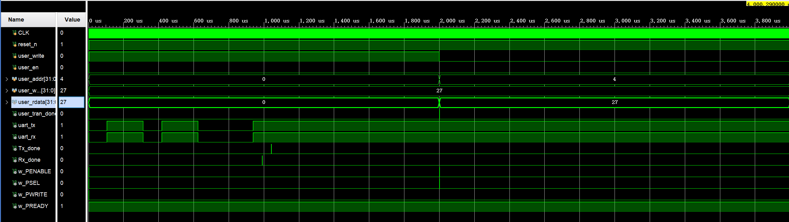

# APB_UART_Subsystem

## 设计功能

**Master 模块 (APB_uart_Master)**
- 支持用户发起读写传输（user_en 脉冲触发）
- 状态机：IDLE → WR/RD → ENABLE → DONE → WAIT → IDLE
- 传输完成后输出 user_tran_done 脉冲
- 读操作返回 user_rdata

**Slave 模块 (APB_uart_Slave)**
- 内部集成 UART 发送和接收模块
- 地址 0（ADDR_TX）：写数据触发 UART 发送
- 地址 4（ADDR_RX）：读数据返回 UART 接收到的数据
- 地址 8（ADDR_STA）：读状态返回 Tx_done 和 Rx_done

**UART 模块 (uart_tx / uart_rx)**
- 波特率 9600，8 位数据位，1 位停止位，无校验
- 发送：send_go 脉冲触发发送，Tx_done 输出完成标志
- 接收：起始位检测带毛刺过滤，采样点位于波特率周期中间

**顶层模块 (APB_uart_top)**
- 例化 Master 和 Slave
- 连接 APB 总线信号

## 验证方法

- 仿真环境：Vivado 自带仿真器
- 自收发回环：assign uart_rx = uart_tx
- 测试流程：写地址 0 数据 27 → 等待 2ms → 读地址 4
- 对比写数据和读数据，一致则 PASS

## 仿真结果

上图展示了：
- 写地址 0：user_wdata = 27
- 读地址 4：user_rdata[7:0] = 27
- 读写数据一致，UART 自收发回环正常

## 文件说明

- uart_tx.v：UART 发送模块
- uart_rx.v：UART 接收模块
- APB_uart_Master.v：APB 主机模块
- APB_uart_Slave.v：APB 从机模块（集成 UART）
- APB_uart_top.v：顶层连接模块
- APB_uart_top_tb.v：仿真 testbench

## 许可证

MIT License
